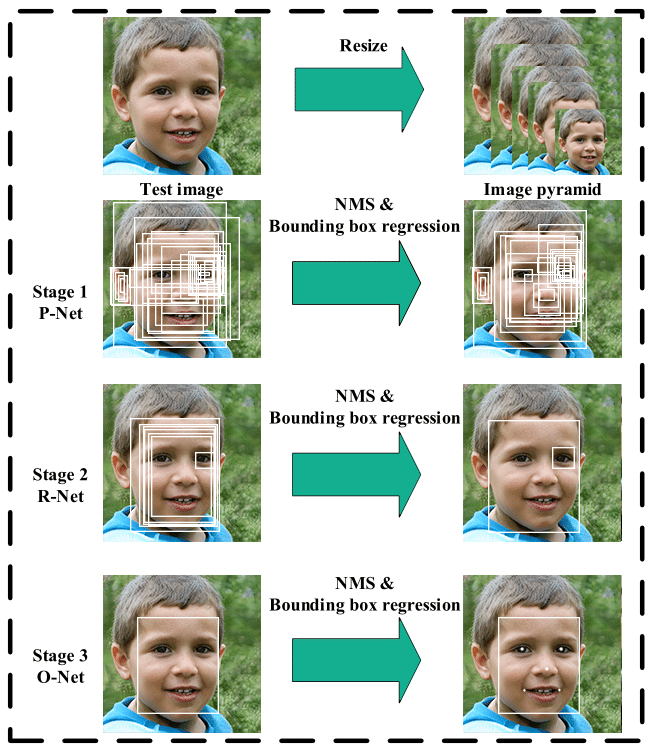

# PROJECT OVERVIEW

## C. IMPLEMENTING THE PROJECT PLAN
### Deliverables:
#### Hardware Requirement:
Laptop which consists of intel core i5 8th Gen and 12GB RAM is used to conduct the project.

#### Software Requirement:
Python programming language is used to implement the program for artificial intelligence module in human face detection and recognizing authorized person. Flask web framework which written in Python is used to design the api and website.

#### Intelligent System Architecture:
Two intelligence system are used in this project which include : 
1. Multi-task Cascaded Convolutional Networks (MTCNN), which is a framework developed as a solution for both face detection and face alignment. The process consists of three stages of convolutional networks that are able to recognize faces and landmark location such as eyes, nose, and mouth. MTCNN process : 

    

2. VGG-Face Framework, which is a type of convolution neural network is used to extract the features (human faces characteristics) and represent in embedding form. VGG-Face architecture : 

    

#### Outcomes of the system
2 main steps will be applied in our system, which is human face recognition and human face identification. Given an input image, the first steps are to recognize the human faces using Multi-task Cascaded Convolutional Networks (MTCNN) and extract the human face from the image. Then fed to an VGG-Face Framework to get its embedding representation to be compared with the faces in the database for identification.

    

### Tasks and Estimated Costs
| Task |  Estimated Costs | Notes |
|-----|----|----|
|   Server Maintenance         |$15000                         |  Monthly Cloud Server      |      
|   Construction supervision   |$30000                         | Supervision on the project | 
|   Devices                    |$14000                         |  Connect the application                                                             |                              |
|   License Software           |$5000                          |  Legal and patented                                                                  |                              |
|   Equipment and equipment use|$800                           | Equipment preparation and setup                                                       |                              |
|   Project signs              |$400                           |  Installation of project signs     |                            |
|   TOTAL                      |$65200                         |  Estimated     |                              |

### Milestone Chart
#### Microsoft Project:

  
##### Next: [Project Execution](D-PROJECT_EXECUTION.md)
