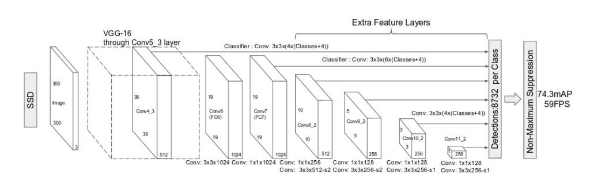

# PROJECT OVERVIEW

## C. IMPLEMENTING THE PROJECT PLAN
### Deliverables:
#### Hardware Requirement:
For the hardware, our group use the laptop come with Ryzen 7 processor  and 16GB of RAM to run our project. 
Laptop which consists of intel core i5 8th Gen and 12GB RAM is used to conduct the project.

#### Software Requirement:
For the software, we use python programming language to implement the code for our intelligent module to recognize the human face and HTML to design the website included with the databse to keep all the information neatly.
Python programming language is used to implement the program for artificial intelligence module in human face detection and recognizing authorized person. Flask web framework which written in Python is used to design the api and website.

#### Intelligent System Architecture:
The proposed neural network used is Convolutional neural networks (CNNs): CNNs are a type of artificial neural network that are particularly well-suited for image processing tasks. They can be trained to recognize patterns in images and extract features that are relevant for a particular task. CNNs have been used successfully for a variety of image recognition tasks, including facial recognition.

#### Outcomes of the system
The outcome of the system should be the ability to accurately recognize and extract the characters from images of faces. The accuracy of the system will depend on a variety of factors, including the quality of the training data, the complexity of the CNN architecture, and the effectiveness of the training algorithm. With a well-designed system and sufficient training data, it is possible to achieve very high accuracy rates for facial recognition using a CNN.

2 main steps will be applied in this system, which is human face detection and recognition. Given an input image, the first steps are to detect the human face using 

license plate using Warped Planar Object Detection Network (WPOOD-Net) and regresses one affine transformation per detection, allowing a rectification of the license plate area to a rectangle resembling a frontal view. These positive and rectified detections are fed to an OCR network for final character recognition. 

### Tasks and Estimated Costs
| Task |  Estimated Costs | Notes |
|-----|----|----|
|   Server Maintenance         |$15000                         |  Monthly Cloud Server      |      
|   Construction supervision   |$30000                         | Supervision on the project | 
|   Devices                    |$14000                         |  Connect the application                                                             |                              |
|   License Software           |$5000                          |  Legal and patented                                                                  |                              |
|   Equipment and equipment use|$800                           | Equipment preparation and setup                                                       |                              |
|   Project signs              |$400                           |  Installation of project signs     |                            |
|   TOTAL                      |$65200                         |  Estimated     |                              |

### Milestone Chart
#### Microsoft Project:

  
##### Next: [Project Execution](D-PROJECT_EXECUTION.md)
