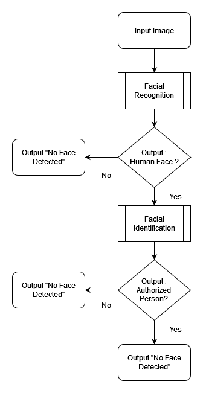

# PROJECT OVERVIEW
## D. EXECUTING THE PROJECT
### Project Design and Coding
Flowchart Design:\


### Description of the project coding and implementation
Libraries and Packages required:
```
Flask==2.2.2
numpy==1.24.0
opencv-python==4.6.0.66
Flask-Cors==3.0.10
mtcnn==0.1.1
keras_applications==1.0.8 
tensorflow==2.11.0
keras_vggface==0.6
```
#### API Server
Firstly, the function will check on the data type sent to the server : 
* if image data is sent, we get the image data and pass into the function named base64_to_cv2, which decode base64 image data and reconstruct as image file, then we save as temporary image file - 'tmp.jpg'. 
* if image file is sent, we simply save the image file as temporary image file - 'tmp.jpg'.

Sebsequently, we pass the path of the image file to function name detect_person to perform recognition and identification and return the result to client side.
```
@app.route("/recognition", methods=['POST'])
def recognition():
	if request.method == 'POST':
		input_path = 'tmp.jpg'
		if 'file' not in request.files:
			input = base64_to_cv2(request.json["image"])
			cv2.imwrite(input_path, input)
		else:
			request.files["file"].save(input_path)
		return detect_person(input_path)
```
```
def base64_to_cv2(image_base64):
    idx = image_base64.find('base64,')
    image_base64  = image_base64[idx+7:]

    image_bytes = base64.b64decode(image_base64)
    np_array = np.fromstring(image_bytes, np.uint8)
    image_cv2 = cv2.imdecode(np_array, cv2.IMREAD_COLOR)
    return image_cv2
```

In detect_person function, we will try to recognize human faces by using extract_face function. If faces are successfully extracted from the image, the function will save the extracted face as record in record folder, rename it by using current date and time and proceed with the facial identification, otherwise, the function will return message "No Face Detected" to client side.
```
def detect_person(input_path):
	try:
		pixels = extract_face(input_path)
		plt.imshow(pixels)
		plt.axis("off")
		record_name  = datetime.now().strftime("%m%d%Y%H%M%S")
		path = os.path.join("record", record_name)
		plt.savefig(path)
	except (ValueError): 
		return "No Face Detected"

	yhat = get_face_embedding(pixels)
	return get_result(yhat)
```
Sample of Extracred face : \


#### Facial Recognition
In extract_face function, we try to detect human faces by using Multi-task Cascaded Convolutional Networks (MTCNN) detector, if faces are detected, we will extract the first face by getting the (x, y) coordintion, width and height, construct an image array and return the array. 
```
def extract_face(filename, required_size=(224, 224)):
	pixels = plt.imread(filename)
	detector = MTCNN()
	try: 
		results = detector.detect_faces(pixels)
		x1, y1, width, height = results[0]['box']
	except:
		raise ValueError("No Face Detected")
	
	x2, y2 = x1 + width, y1 + height
	face = pixels[y1:y2, x1:x2]
	image = Image.fromarray(face)
	image = image.resize(required_size)
	face_array = asarray(image)
	return face_array
```

#### Facial Identification
Two functions are involved in this section which include :
1. get_embedding() : this function basically extract the features (human face characteristics) from the image by using VGGFace framework and resnet50 model and return the features as array.
```
def get_embeddings(filenames):
	faces = [extract_face(f) for f in filenames]
	samples = asarray(faces, 'float32')
	samples = preprocess_input(samples, version=2)
	model = VGGFace(model='resnet50', include_top=False, input_shape=(224, 224, 3), pooling='avg')
	yhat = model.predict(samples)
	return yhat
```

2. get_result() : this function measure the similarity between the features of face extracted from the image provided by client side and the features of faces that exists in our database by using cosine similarity method. Then we sort the result based on the cosine value, and return the first name if the cosine similarity value does not exceed the 0.5 threshold, else return message "No Authorized Personnel detected"
```
def get_result(yhat):
	cosine_similarity = [cosine(yhat[0],item) for item in database_embedding]
	database = pd.DataFrame(data = {"name" : names, "cosine" : cosine_similarity})
	database = database.sort_values(by=['cosine'], ignore_index=True)

	if database['cosine'][0] <= 0.5:
		name = os.path.splitext(database['name'][0])[0]
		name = name.replace("_", " ").split(" ")
		name = " ".join( i.capitalize() for i in name)
		return "Welcome " + name
	else:
		return "No Authorized Personnel detected"
```

### Project Result
Result using Web API:\


<br><br>
##### Next: [Project Closing](E-PROJECT_CLOSING.md)