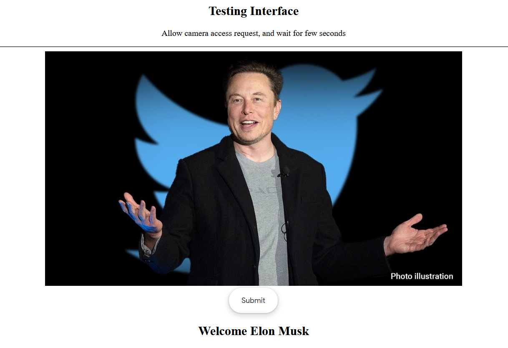

# PROJECT OVERVIEW
## D. EXECUTING THE PROJECT
### Project Design and Coding
Flowchart Design:\


### Description of the project coding and implementation
Libraries and Packages required:
```
deepface==0.0.75
Flask==2.2.2
numpy==1.24.0
opencv-python==4.6.0.66
Flask-Cors==3.0.10
```

Facial Recognition: Firstly, we load our model from the pre-trained which created by sergiomsilva.From our Github repository, two files: wpod-net.h5 and wpod-net.json canbe found. Notifications "loading model successfully..." should be get after this step.

Subsequently, we create a function name preprocess_image to read and pre-process our plate images. This function basically reads the parsing image, converts it to RGB (line 3) and normalizes the image data to 0–1 range so it can be compatible with matplotlib. Additionally, we can set resize = True to resize all images to same dimension of (width = 224, height = 224) for visualizing purpose in the next step. 

In this step, we visualize our vehicle dataset. This dataset contains of 20 vehicle images with plate acquired from 10 different countries (Germany, Vietnam, Japan, Thailand, Saudi, Russia, Korea, Usa, India, China). The following block of code will display plate images and their country names in a figure containing of 5 columns and 4 rows.

Now, function named get_plate which processes the raw image is written, and is sent to our model and return the plate image (LpImg) and its coordinates (cor). If there is no plate founded, the program would warn with an error “No License plate is founded!”. 

We draw a bounding box with obtained coordinates of deteced plate. 
We perform get_plate function to all vehicle images and plot the returend plate images. 

### Project Result
Result using Web API:\


<br><br>
##### Next: [Project Closing](E-PROJECT_CLOSING.md)

