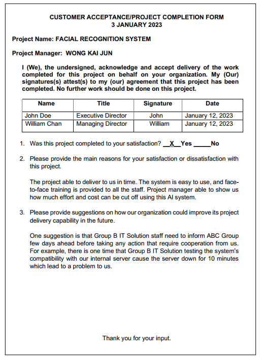
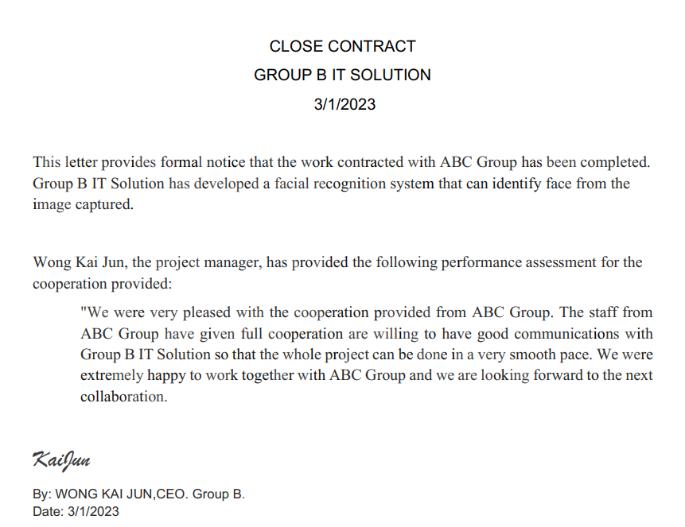

# PROJECT OVERVIEW

## E. COMPLETING THE PROJECT
### Closing Checklist
 

#### 1. Customer Acceptance Form

    

#### 2. Lessons Learned Document

    

#### 3. Final Project Report
**FACIAL RECOGNITION SYSTEM**

**1.0 PROJECT OBJECTIVES**

The facial recognition system is done by Group B IT Solution. It was intended to develop an artificial intelliegent system that have a ability to detect human faces. besides our other target we can recognize the character of the human faces. that not the limitation when we also move forward in order to develop an application programming interface API for future use as the integration module.**

**2.0 SUMMARY OF PROJECT RESULTS**

After the system complete, we got accuracy around 92% from the system tested. 

**3.0 ORIGINAL AND ACTUAL SCHEDULE**

**4.0 ORIGINAL AND ACTUAL BUDGET**

    

**5.0 PROJECT ASSESSMENT**

**5.1 SCOPE**

The project scope and hardware specification for the facial recognition system was initiated from the beginning of the project. For example, the system may unable to identify human face when the captured image have high back light or low visibility as the quality of image is affected which cause the system unable to extracted human faces from it. Other than that, the project does not include the backup power, which mean the system may not working when power supply shut down.

**5.2 OBJECTIVES**

Group B IT Solution successfully met the objectives that were established at the start of the project. We developed an artificial intelligence-powered system that utilizes deep learning techniques. Deep learning was used to identify patterns on faces and discern facial shapes. Additionally, Flask Web Framework as API server to implement the python program that are used to identify authorized individual into a html website. This allowed us to achieve their goal of building an API within the system.

**5.3 IMPACTS**

When this system develop, we can easily identify people just by using their faces, this can avoid from undercovered people or someone who in planning to pretending like other person which improve the security level. The authentication process will also become more convinent as the staff not requrie to key in and memorize the password. Other than that, it also convinent for the management in maintaining the authorize person list simply register and unregister the individual's face in the system.

**6.0 TRANSITION PLAN**

Group B IT Solution will provide support as needed for the facial recognition system project. The main responsibilities for supporting the project include maintaining the system, addressing errors and updates, providing user guidelines for clients, and reporting information to senior management on a monthly basis.

#### 4. Close Contract

    

